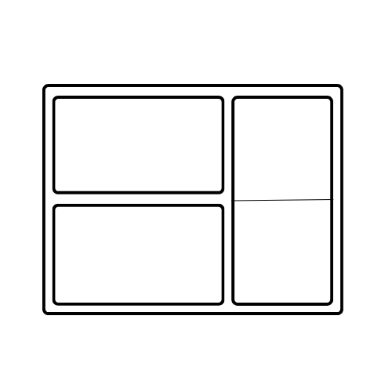

## 
  Hello, i'm Vladislav 

---

### **I'm a C# developer.**

___

## About Me:

I've been programming for **3** years now.  
I am an experienced software developer with a deep understanding of asynchronous and multithreaded programming.  
I have the ability to analyze and determine the necessity of multithreading and apply it effectively, especially in scenarios involving CPU-bound tasks.  
I have experience in identifying and eliminating data races to ensure data integrity and system stability.
 
I like to delve into *low-level code* and solve **non-standard tasks related to interacting with the target system**.
 
I enjoy **developing desktop applications** and *optimizing programs*.

I know a little bit C++ and continue to study it. **I'm also learning Rust since I like this language for its safety**.
I've also been involved in **reverse engineering (as a hobby)**, and it's very exciting. 😊

## Achievements:

- **Optimization Initiative:** Led efforts to optimize a critical system, reducing processing time by 30% through parallelization and algorithm enhancements.
- **Development of Concurrent Environment:** Designed and implemented a custom library adapted to the requirements of a high-performance data processing application, significantly improving scalability and performance through pipeline processing.

___

#### Something you're not ashamed to show ↴

|             Project              |                                                                                                                                                                                                      Desctiprion                                                                                                                                                                                                      |                                                                                                                                  Status                                                                                                                                  |
|:--------------------------------:|:---------------------------------------------------------------------------------------------------------------------------------------------------------------------------------------------------------------------------------------------------------------------------------------------------------------------------------------------------------------------------------------------------------------------:|:------------------------------------------------------------------------------------------------------------------------------------------------------------------------------------------------------------------------------------------------------------------------:|
| 
 **FRAME**
 | 
      
 | 
  
 |

___

## Apps Skills 

|                                                                                                                                                      IDE                                                                                                                                                       |                                                                                                        Engine                                                                                                         |                                                                                              Debugers                                                                                              | **Languages**                                                                                                                                                                                                                                                                                                                                                                                                                                                                                                                                                                                                                                                              |                   Decompiler                    |
|:--------------------------------------------------------------------------------------------------------------------------------------------------------------------------------------------------------------------------------------------------------------------------------------------------------------:|:---------------------------------------------------------------------------------------------------------------------------------------------------------------------------------------------------------------------:|:--------------------------------------------------------------------------------------------------------------------------------------------------------------------------------------------------:|:---------------------------------------------------------------------------------------------------------------------------------------------------------------------------------------------------------------------------------------------------------------------------------------------------------------------------------------------------------------------------------------------------------------------------------------------------------------------------------------------------------------------------------------------------------------------------------------------------------------------------------------------------------------------------|:-----------------------------------------------:|
|     **RustRover**   **Fleet** |   |   **dotMemory**   **dotTrace**   **Unity Profiler** |                | **IDA Pro**   **Ghidra**    **dotPeek** |

### Technical Skills:
- **Programming Paradigms:** Proficient in asynchronous and multithreaded programming, adept at utilizing parallelism to enhance application performance and responsiveness.
- **Performance Optimization:** Skilled in identifying and addressing CPU-bound bottlenecks through efficient parallelization and algorithm optimization.
- **Data Integrity:** Experienced in designing and implementing thread-safe data structures and synchronization mechanisms to prevent data races and ensure data consistency.
- **Design Patterns:** Deep knowledge and application of various design patterns to create modular, maintainable, and extensible software systems.
- **Architectural Design:** Proficient in developing architectural solutions tailored to project requirements, utilizing best practices and architectural patterns.

#### Creational Patterns:
- Factory Method
- Abstract Factory
- Singleton(👎)

#### Structural Patterns:
- Bridge
- Decorator
- Proxy

#### Behavioral Patterns:
- Chain of Responsibility
- Command
- Iterator
- Mediator
- Observer
- State
- Strategy
- Template Method
- Visitor

#### Architectural Pattern:
- Model-View-Controller (MVC)
### Socials

 <a href="https://www.github.com/0Ziver" target="_blank" rel="noreferrer"> <picture> <source media="(prefers-color-scheme: dark)" srcset="https://raw.githubusercontent.com/danielcranney/readme-generator/main/public/icons/socials/github-dark.svg" /> <source media="(prefers-color-scheme: light)" srcset="https://raw.githubusercontent.com/danielcranney/readme-generator/main/public/icons/socials/github.svg" />  </picture> </a>
<a href="https://www.linkedin.com/in/0ziver" target="_blank" rel="noreferrer"> <picture> <source media="(prefers-color-scheme: dark)" srcset="https://raw.githubusercontent.com/danielcranney/readme-generator/main/public/icons/socials/linkedin-dark.svg" /> <source media="(prefers-color-scheme: light)" srcset="https://raw.githubusercontent.com/danielcranney/readme-generator/main/public/icons/socials/linkedin.svg" />  </picture> </a>

### Support Me

</li>

